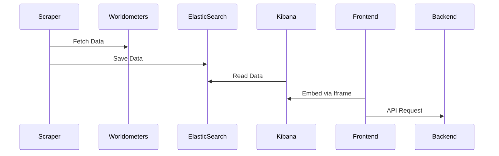

# Real-Time Population Dashboard

🌍 Live population tracking dashboard using Worldometers data


## ✨ Key Features
- Real-time data retrieval from Worldometers
- Interactive frontend with Vue.js
- Integration of Kibana visualizations via iframe
- Responsive and modern design
- Country-based detailed analysis

## 🛠 Technology Stack
- **Frontend**: Vue.js 3 + Vite
- **Backend**: Node.js + Express
- **Data Scraping**: Puppeteer (Headless Chrome)
- **Data Storage**: ElasticSearch
- **Visualization**: Kibana

## 🚀 Installation

### 1. Prerequisites
- Node.js v18+
- ElasticSearch 8.x
- Kibana 8.x

### 2. Frontend (Vue.js)
```bash
cd client
npm install
npm run dev
```
### 3. Scraper (Node.js)
```bash
cd scraper
npm install
node index.js
```

### 4. Backend (Node.js)
```bash
cd server
npm install
node server.js
```

##📊 Data Flow
### 5. Sequence Diagram

## 🌐 Use
1. Run the scraper:
```bash
node scraper.js
```
2. Start the Vue application:
```bash
npm run dev
```
3. Open in your browser:
```bash
[npm run dev](http://localhost:5173)
```
## 🔗 Related Repositories
- [Data Scraping System and ElasticSearch Configurations ](https://github.com/fehu-zone/population-scraper-node)

## 🤝 Contribution
1. Fork the repository
2. Create a new branch:
```bash
git checkout -b feature/your-feature
```
3. Commit your changes:
```bash
git commit -am 'Add some feature'
```
## ⚠️ Important Notes
- ElasticSearch connection details should be stored in the `.env` file.
- Additional Puppeteer settings might be required for the scraping process.
- Kibana iframe URLs should be updated according to your environment.
